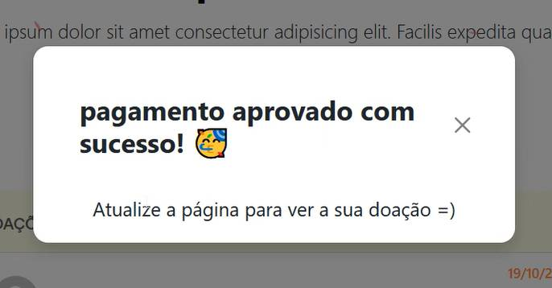
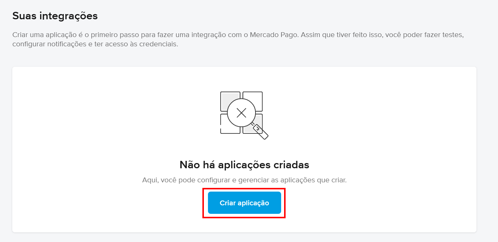
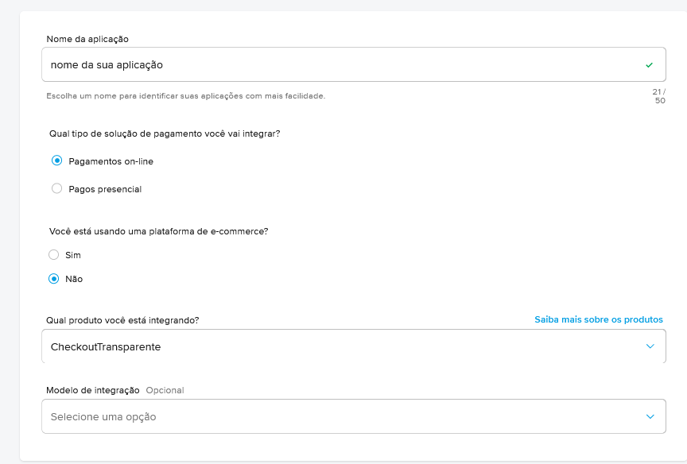
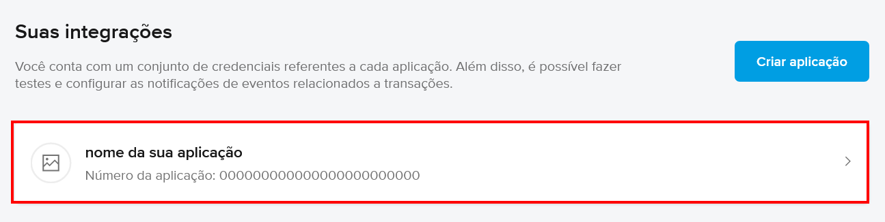
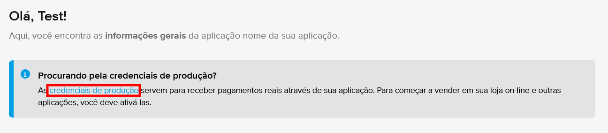
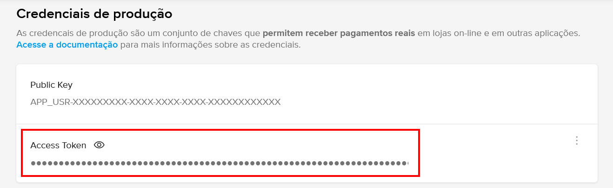

<div align="center">
  <h1>
    
    
    <br>QRCode Pix MercadoPago - PHP
  </h1>
    <p>Este é um projeto simples que utiliza a API do Mercado Pago para gerar pagamentos via PIX, incluindo QR Code e código "copia e cola". Além disso, a atualização do status do pagamento é realizada automaticamente no banco de dados MySQL.</p>
</div>

---
## Demonstração:

<div align="center">
    
</div>

---


## Sobre

O objetivo deste projeto é permitir doações para uma pessoa ou projeto, sem a necessidade de autenticação. O visitante pode contribuir com qualquer valor, bastando preencher alguns dados, como seu apelido, e-mail e mensagem a ser compartilhada com quem acessar o site.

<div align="center">
    
</div>

<hr>

<div align="center">
  <p>
    Após a aprovação do pagamento, a doação do usuário será exibida na tela inicial do site, contendo o apelido, o valor doado, a data da doação e uma mensagem (se houver). Semelhante ao <b>Buy me a coffee</b> e <b>Twitch</b>. 
  </p>
    <br>
</div>

<hr>

<div align="center">
    <p>Se o pagamento for aprovado enquanto o usuário ainda estiver no site, automaticamente uma mensagem será enviado a ele.</p>
    <br>
</div>

<hr>
<div align="center">
    <p>O site também apresenta os maiores doadores.</p>
    <br>
</div>


---

## ⚙️ Configurações:

Para configurar a conexão com o banco de dados, acesse o arquivo "<b><a href="https://github.com/HenriqueCacerez/QRCode-PIX-MercadoPago-php/blob/main/app/credentials.php">app/credentials.php</a></b>". Adicione o seu <b>"ACCESS_TOKEN"</b> em ``MERCADO_PAGO_CONFIG`` para receber os valores das doações em sua conta. 

Além disso, é necessário definir a <b>"NOTIFICATION_URL"</b>, que é a URL onde o Mercado Pago enviará as notificações para alertar sobre o status do pagamento.


<p>É importante ressaltar que as notificações do Mercado Pago <b>não funcionam em ambientes locais</b>, portanto, será necessário testá-las em um site real que esteja online.</p>

<p>O site precisa ter o certificado SSL habilitado (HTTPS)</p>

---


<details>
  <summary><h2>Mercado Pago (ACCESS TOKEN)</h2>
  <p>Criando o Access Token e definindo a URL de notificações.</p>
  </summary>
  <ol><br>
    <li>
      <b>Criando uma aplicação.</b>
      <p>Acesse <a href="https://www.mercadopago.com.br/developers/panel/app">https://www.mercadopago.com.br/developers/panel/app</a> enquanto estiver conectado à sua conta no Mercado Pago e crie uma nova aplicação.</p><br>
      <ul>
        <p align="center">
          
        </p>
      </ul>
    </li>
    <li>
      <b>Dados da Aplicação</b>
      <p>Personalize os detalhes da sua aplicação de acordo com suas preferências. Exemplo utilizado para este projeto:</p><br>
        <p align="center">
          
        </p><br>
      </ul>
    </li>
    <li>
      <b>Acessando sua Aplicação</b>
      <p>Depois de ter criado a aplicação, retorne às <a href="https://www.mercadopago.com.br/developers/panel/app">suas integrações</a> e acesse a aplicação que acabou de ser criada.</p><br>
        <p align="center">
          
        </p><br>
        <p>Acesse <b>"credenciais de produção"</b></p><br>
        <p align="center">
          
        </p><br>
    </li>
    <li>
      <b>Salve o seu Access Token.</b>
      <p>Copie o seu Access Token de produção e insira-o no arquivo "<b><a href="https://github.com/HenriqueCacerez/QRCode-PIX-MercadoPago-php/blob/main/app/credentials.php">app/credentials.php</a></b>".</p><br>
       <p align="center">
          
        </p>
    </li>
    <hr>
    <h4>Exemplo:</h4>

```php
    const MERCADO_PAGO_CONFIG = [
        "access_token"     => "SEU_ACCESS_TOKEN",
        "notification_url" => "https://example.com/payment/notification.php"
    ];
```

  </ol>
</details>