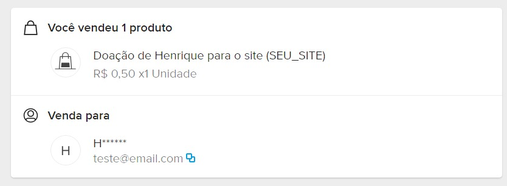
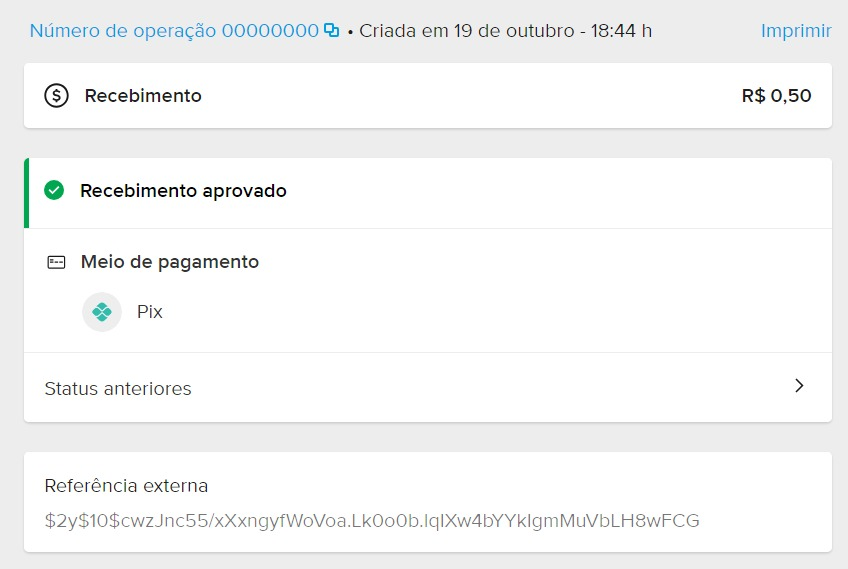

  <h1>
    
    
     QRCode Pix MercadoPago - PHP
  </h1>
    
Este é um projeto simples que utiliza a API do Mercado Pago para gerar pagamentos via PIX, incluindo QR Code e código "copia e cola". Além disso, a atualização do status do pagamento é realizada automaticamente no banco de dados MySQL.

---
## Demonstração:

    

---

## Sobre

O objetivo deste projeto é permitir doações para uma pessoa ou projeto, sem a necessidade de autenticação. O visitante pode contribuir com qualquer valor, bastando preencher alguns dados, como seu apelido, e-mail e mensagem a ser compartilhada com quem acessar o site.

    

  

    Após a aprovação do pagamento, a doação do usuário será exibida na tela inicial do site, contendo o apelido, o valor doado, a data da doação e uma mensagem (se houver). Semelhante ao <b>Buy me a coffee</b> e <b>Twitch</b>. 
  

     

    
Se o pagamento for aprovado enquanto o usuário ainda estiver no site, automaticamente uma mensagem será enviado a ele.

     

    
O site também apresenta os maiores doadores.

     

    
Em  <a href="https://www.mercadopago.com.br/home">"Sua atividade"</a> do Mercado Pago, você verá a doação do usuário    apresentada de forma semelhante a isto:

     
     

    

---

## ⚙️ Configurações:

Para configurar a conexão com o banco de dados, acesse o arquivo "<b><a href="https://github.com/HenriqueCacerez/QRCode-PIX-MercadoPago-php/blob/main/app/credentials.php">app/credentials.php</a></b>". Adicione o seu <b>"ACCESS_TOKEN"</b> em ``MERCADO_PAGO_CONFIG`` para receber os valores das doações em sua conta. 

Além disso, é necessário definir a <b>"NOTIFICATION_URL"</b>, que é a URL onde o Mercado Pago enviará as notificações para alertar sobre o status do pagamento.

É importante ressaltar que as notificações do Mercado Pago <b>não funcionam em ambientes locais</b>, portanto, será necessário testá-las em um site real que esteja online.

O site precisa ter o certificado SSL habilitado (HTTPS)

---

## 🔑 Mercado Pago (ACCESS TOKEN)

  
<strong>Clique aqui</strong> para ver como obter o seu access token

  ### 1. Criando uma Aplicação:
  Acesse [https://www.mercadopago.com.br/developers/panel/app](https://www.mercadopago.com.br/developers/panel/app) e crie uma nova aplicação.

  

      
  

  ### 2. Dados da Aplicação:
  Exemplo:

  

    
  

  ### 3. Acessando sua Aplicação:
  Depois de ter criado a aplicação, retorne às [suas integrações](https://www.mercadopago.com.br/developers/panel/app) e acesse a aplicação que acabou de ser criada.

  

    
  

   ### 4. Credenciais de Produção:

  

    
  

  ### 5. Salve o seu Access Token:
  Copie o seu Access Token de produção e insira-o no arquivo [app/credentials.php](https://github.com/HenriqueCacerez/QRCode-PIX-MercadoPago-php/blob/main/app/credentials.php)

  

    
  

